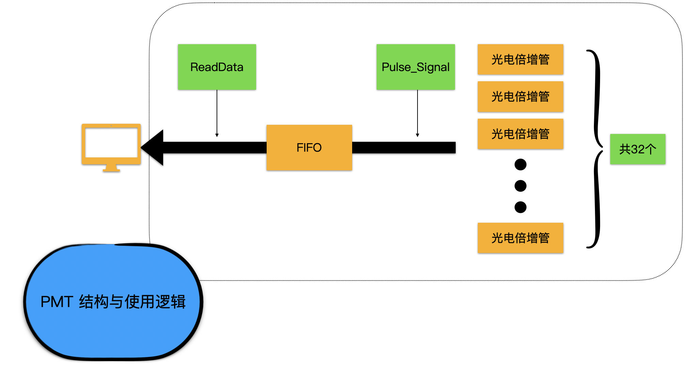

# PMT

## Abstract

PMT 模块是离子阱系统所有读出信号的来源. 它通过 32 通道的光电倍增管来接收离子发出的荧光, 并生成荧光计数, 保存在 FIFO 缓存区, 供电脑读取.

具体来说, PMT 模块有一个同轴线用于接收高低电平信号. 每个电平上升沿会开启荧光计数, 每个下降沿关闭荧光计数, 并将 32 通道的荧光计数保存在 FIFO 中. 电脑端每调用一次 read_data 指令, 就会读取 FIFO 中最先的数组. 同时 FIFO 中的相应数组被删除.
