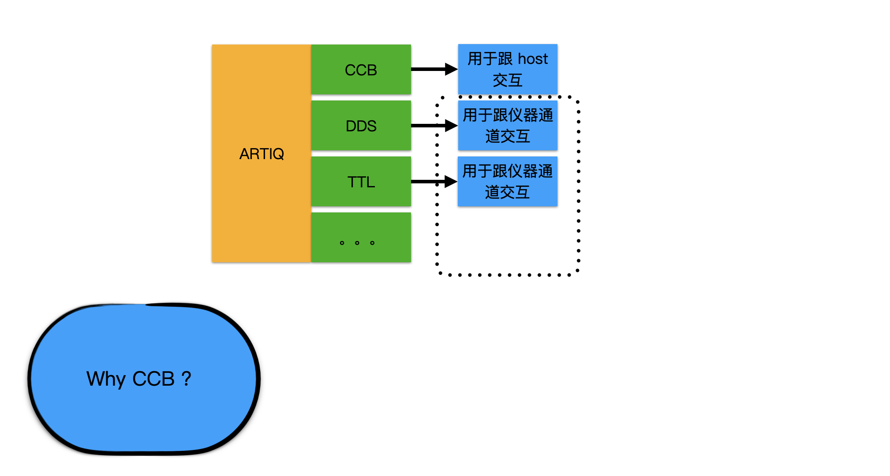

# CCB(Clint Control Broadcasts)

## 1. Why CCB?


1. 需求：实验中会碰到给主机发送任务指令的场景，例如每次循环实验要更新一次主机的图像
2. 现有逻辑：实验涉及仪器的编写逻辑是，core + 多个仪器，每个仪器有自己的行为
3. 解决需求：创造一个 ccb 虚拟仪器，其主要方法就是跟负责跟 host 通信。目前主要用于调用绘图小组件





## 2. 如何实现？

每当在 build 中添加 "ccb" 时，下列虚拟仪器就会被添加为本次实验的属性：

```python
logger = logging.getLogger(__name__)

class DummyCCB:
    def issue(self, service, *args, **kwargs):
        logger.info("CCB for service '%s' (args %s, kwargs %s)",
                    service, args, kwargs)

```

该虚拟仪器的唯一方法 issue ，将调用 logger 对象在日志记录器中添加一条 info 级别的信息。

例如：

```python
self.ccb.issue("create_applet", "PMTcounts", "${artiq_applet}plot_xy PMTcounts --fit PMTcounts", "Rabicounts 32channel")
```

将记录一条

```css
INFO: CCB for service 'create_applet' (args ('PMTcounts', '${artiq_applet}plot_xy PMTcounts --fit PMTcounts', 'Rabicounts 32channel'), kwargs {})
```

host 中的客户端组件将捕获这条信息，并执行关键字所对应的指令。
